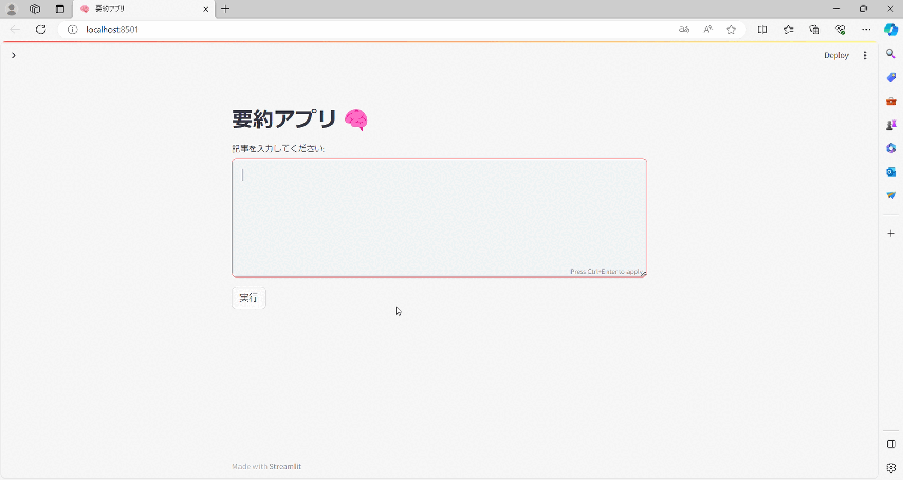

# GPTを用いた文章要約アプリ




<br>

## 目次
* [概要](#anchor1)
* [環境](#anchor2)
* [環境構築の手順](#anchor3)  
    * [pythonのインストール(Windowsの場合)](#anchor3_1)  
    * [pipのインストール](#anchor3_2)  
    * [streamlitのインストール](#anchor3_3)  
    * [langchainの環境構築](#anchor3_4)  
* [使い方](#anchor4)
* [ファイル構成](#anchor5)
* [参考](#anchor6)
* [作成者](#anchor7)

<br>
<a id="anchor1"></a>

## 概要
要約したい記事の内容をテキストボックスに入力し、実行することで記事の要約を行うことができます。  

<br>
<a id="anchor2"></a>

## 環境

|言語・フレームワーク|バージョン |
|-------------------|----------|
|pip                |23.2.1    |
|python             |3.12.0    |
|streamlit          |1.28.1    |
|langchain          |0.0.340   |

<br>
<a id="anchor3"></a>

## 環境構築の手順
<a id="anchor3_1"></a>

## pythonのインストール(Windowsの場合)
 1. [こちら](https://pythonlinks.python.jp/ja/index.html)からPythonパッケージをダウンロードする  
 2. ダウンロードしたパッケージをインストールする  
 3. コマンドプロンプトを起動し`Python`と入力し実行する
 4. スタートメニューで **Windows PowerShell | Windows PowerShell** を起動し、次のコマンドを実行する
 ```
 Set-ExecutionPolicy RemoteSigned -Scope CurrentUser -Force
 ```
詳しくは以下の記事を参考にしてください。  
https://www.python.jp/install/windows/install.html  

[macの場合](https://prog-8.com/docs/python-env)

<br>
<a id="anchor3_2"></a>

## pipのインストール
事前にPythonをインストールしてください。
### windowsの場合
1. ダウンロード先：https://bootstrap.pypa.io/get-pip.py よりget-pip.pyを任意のディレクトリに保存する
2. 保存したディレクトリで下記コマンドを実行する
```
python get-pip.py
```
### Linux(CentOS)の場合
1. pipをインストールする
```
curl -kL https://bootstrap.pypa.io/get-pip.py | python
```

<br>
<a id="anchor3_3"></a>

## streamlitのインストール
1. 以下のコマンドを実行してpipをアップグレードする
```
python3 -m pip install --upgrade pip
```

2. 以下のコマンドでstreamlitをインストールする
```
python3 -m pip install --upgrade pip
```

<br>
<a id="anchor3_4"></a>

## langchainの環境構築
1. 以下のコマンドでlangchainをインストールする
```
pip install langchain
```
2. OpenAI API 用の SDKをインストールする
```
pip install openai
```
3. [OpenAI|API-KEYSページ](https://platform.openai.com/account/api-keys)からAPIキーを確認して環境変数に設定する
```
export OPENAI_API_KEY="..."
```

<br>

<a id="anchor4"></a>

## 使い方

1. 文章要約アプリを使用したい場合は、コマンドプロンプトにおいて以下のコマンドを実行する

```
$ streamlit run chatbot.py
```
2. アプリ起動後はテキストボックスに要約したい記事の内容を入力して
実行ボタンをクリックすることで記事の要約を行うことができる


<br>
<a id="anchor5"></a>

## ファイル構成
* .streamlit/config.toml  
streamlitの設定用ファイル。  

* zeroshot_mapReduce.py  
zeroshot学習×MapReduce法で要約を行うアプリ。（性能比較用）  

* twoshot_mapReduce.py  
twoshot学習×MapReduce法で要約を行うアプリ。（性能比較用）  

* zeroshot_refine.py  
zeroshot学習×refine法で要約を行うアプリ。（性能比較用）  

* twoshot_refine.py  
twoshot学習×refine法で要約を行うアプリ。（性能比較用）

* chatbot.py  
メインの要約アプリ。用いている手法はtwoshot学習×refine法。起動方法は[こちら](#anchor4)。  

* pythonrouge.ipynb  
要約した文章をROUGEを用いて評価するプログラム。

* README.md, howtouse.gif  
README用のファイル。
* requirements.txt  
使用している外部ライブラリを記入。アプリをデプロイする際に必要。


<br>
<a id="anchor6"></a>

## 参考
https://www.python.jp/install/windows/install.html

https://qiita.com/suzuki_y/items/3261ffa9b67410803443

https://simple-365.com/%E3%80%902023%E5%B9%B43%E6%9C%88%E3%80%91streamlit%E3%81%AE%E3%82%A4%E3%83%B3%E3%82%B9%E3%83%88%E3%83%BC%E3%83%AB%E6%96%B9%E6%B3%95%E3%81%A8%E3%82%A8%E3%83%A9%E3%83%BC%E8%A7%A3%E6%B1%BA%E6%96%B9/

https://book.st-hakky.com/data-science/langcain-in-python/

<br>
<a id="anchor7"></a>

## 作成者
福島啓太  
寺島稜介  
西脇弘輝  
高平愛己


